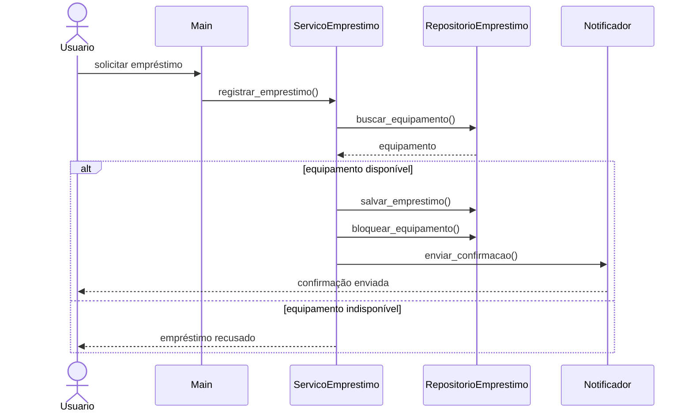
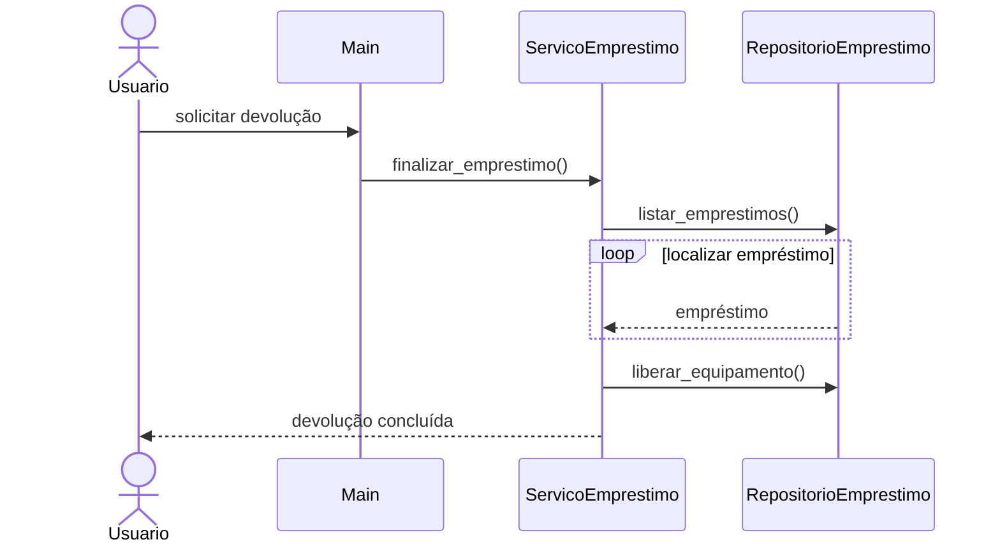
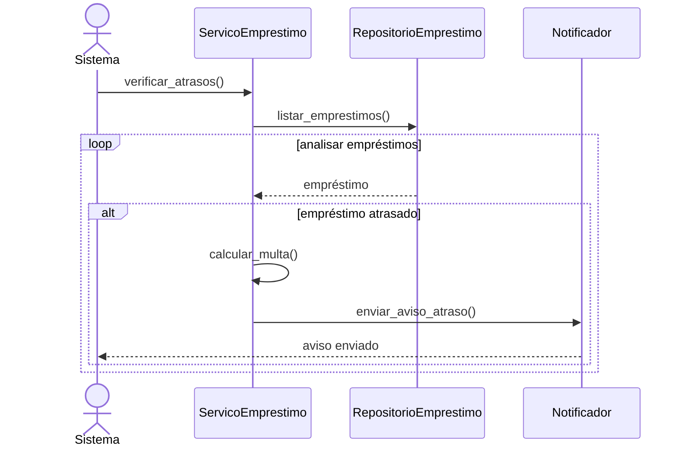

# Diagramas e Organização do Sistema

A estrutura implementada foi baseada na arquitetura definida anteriormente e nos princípios discutidos na resenha da Aula 3, principalmente separação de responsabilidades, redução de acoplamento e melhoria da organização do código.

---

# Organização dos módulos

## models/Equipamento

Responsável por representar os equipamentos disponíveis no sistema e suas regras específicas de multa.

## models/Emprestimo

Armazena os dados relacionados aos empréstimos realizados pelos usuários.

## services/ServicoEmprestimo

Centraliza as operações principais do sistema, como registro de empréstimos, devoluções e verificação de atrasos.

## services/Notificador

Responsável pelo envio de avisos e mensagens do sistema.

## repositories/RepositorioEmprestimo

Gerencia o armazenamento temporário dos dados de empréstimos e equipamentos.

## main.py

Responsável por iniciar a execução principal da aplicação.

---

# UC01 — Registrar Empréstimo

---

# UC02 — Registrar Devolução

---

# UC03 — Verificar Atrasos

